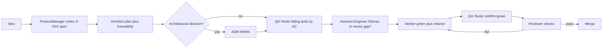

# Spec-driven development (SDD)

This workspace ties product intent to code through **numbered specs** (`S-XXX`), **acceptance criteria** (`AC-N`), **plans** (`plan.md` + tasks under `specs/`), and **tests** named after criteria.

## Lifecycle

> Two execution modes: run the steps below manually via [orchestrator.md](../prompts/orchestrator.md), or end-to-end automated via [auto-orchestrator.md](../prompts/auto-orchestrator.md). The seven steps are identical.

1. **Idea** — captured informally (ticket, conversation).
2. **Spec** — [product-manager prompt](../prompts/product-manager.md) produces `specs/S-XXX-<slug>.md` from [specs/_template.md](../specs/_template.md).
3. **Plan** — [architect prompt](../prompts/architect.md) produces `plan.md` with a **traceability** table: each task maps to the ACs it closes. Structural decisions require a new ADR under [project/docs/adr/](./adr/) using [project/docs/adr/_template.md](./adr/_template.md).
4. **Failing tests** — [qa-tester prompt](../prompts/qa-tester.md) writes automated tests first; blocks named `S-XXX AC-N: …`; red output before implementation.
5. **Harness** — if factories or approved fixtures are missing, [harness-engineer prompt](../prompts/harness-engineer.md) extends `<TEST_HARNESS_ROOT>` and boundary doubles (see [test-harness.md](./test-harness.md)).
6. **Implementation** — [worker prompt](../prompts/worker.md) minimal change to green, then optional refactor; footer `Closes: S-XXX#AC-N`.
7. **Review** — [reviewer prompt](../prompts/reviewer.md) PASS/FAIL gates including spec citation and telemetry tests when the spec defines them.

## Pipeline diagram

## References

- [Harness engineering for coding agent users](https://martinfowler.com/articles/harness-engineering.html)
- [Architecture](./architecture.md)
- [Domain glossary](./domain-glossary.md)
- ADRs: [project/docs/adr/](./adr/) — template [project/docs/adr/_template.md](./adr/_template.md)
