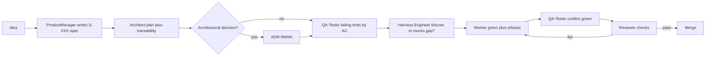
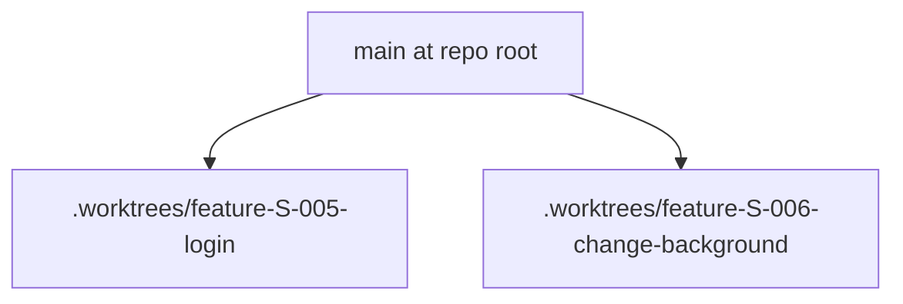

# Spec-driven development (SDD)

This workspace ties product intent to code through **numbered specs** (`S-XXX`), **acceptance criteria** (`AC-N`), **plans** (`plan.md` + tasks under `specs/`), and **tests** named after criteria.

## Lifecycle

> Two execution modes: run the steps below manually via [orchestrator.md](../prompts/orchestrator.md), or end-to-end automated via [auto-orchestrator.md](../prompts/auto-orchestrator.md). The seven steps are identical. **Optionally** run [worktree-coordinator.md](../prompts/worktree-coordinator.md) first to create a **dedicated git worktree** + branch (see **Parallel features** below).

1. **Idea** — captured informally (ticket, conversation).
2. **Spec** — [product-manager prompt](../prompts/product-manager.md) **grills the requester one question at a time (with recommended answers)** and produces `specs/S-XXX-<slug>.md` from [specs/_template.md](../specs/_template.md). Same *document-the-domain-as-you-go* style as common “grill-with-docs” guidance: vocabulary lives in [domain-glossary.md](./domain-glossary.md); ADRs stay under [project/docs/adr/](./adr/) via the architect when decisions are hard to reverse.
3. **Plan** — [architect prompt](../prompts/architect.md) produces `plan.md` with a **traceability** table: each task maps to the ACs it closes. Structural decisions require a new ADR under [project/docs/adr/](./adr/) using [project/docs/adr/_template.md](./adr/_template.md).
4. **Failing tests** — [qa-tester prompt](../prompts/qa-tester.md) writes automated tests first; blocks named `S-XXX AC-N: …`; red output before implementation. Prefer **vertical slices** (tracer bullets): one AC’s failing test → minimal implementation → next AC—avoid bulk-writing every test before any production code.
5. **Harness** — if factories or approved fixtures are missing, [harness-engineer prompt](../prompts/harness-engineer.md) extends `<TEST_HARNESS_ROOT>` and boundary doubles (see [test-harness.md](./test-harness.md)).
6. **Implementation** — [worker prompt](../prompts/worker.md) minimal change to green for the **current** failing test / AC, then optional refactor; footer `Closes: S-XXX#AC-N`.
7. **Review** — [reviewer prompt](../prompts/reviewer.md) PASS/FAIL gates including spec citation and telemetry tests when the spec defines them.

## Pipeline diagram

## Parallel features (git worktrees)

Run **multiple specs at once** without agents overwriting each other’s files: create one **linked worktree + branch per feature** from your trunk (`main` / `master`), run `product-manager` → … → `reviewer` **inside that directory**. Configuration lives under **Parallel execution (worktrees)** in `.cursorrules`.

Implementation helper (bash, repo root):

- [`../scripts/tack-worktree.sh`](../scripts/tack-worktree.sh) — `create`, `next-spec-id`, `list`, `path`, `remove`.

Suggested flow (also orchestrated by [auto-orchestrator.md](../prompts/auto-orchestrator.md) Step −1):

1. Reserve the next spec id across **all** worktrees: `bash project/scripts/tack-worktree.sh next-spec-id`.
2. Create a branch `feature/S-XXX-<slug>` and checkout under `.worktrees/…`: `bash project/scripts/tack-worktree.sh create "<slug>" [--spec S-XXX]`.
3. Open a dedicated agent **with cwd = that worktree path** and run the usual SDD prompts.

Cleanup when merged: `bash project/scripts/tack-worktree.sh remove <slug-or-path>` (see script `--help`). Additional design notes ship with the **tack-bootstrap** skill source at `references/worktree-design.md` (developer reference; not required at runtime).

## References

- [Harness engineering for coding agent users](https://martinfowler.com/articles/harness-engineering.html)
- [Architecture](./architecture.md)
- [Domain glossary](./domain-glossary.md)
- ADRs: [project/docs/adr/](./adr/) — template [project/docs/adr/_template.md](./adr/_template.md)
