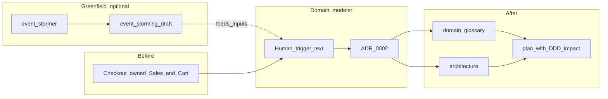

# OrderFlow DDD walkthrough (Sales boundary)

This folder is a **fictitious post–domain-modeler slice** of **OrderFlow** with `tack.ddd.profile = on`: three bounded contexts (**Checkout**, **Payments**, **Fulfillment**), an ADR that records moving **Sales** concerns out of Checkout into **Payments**, and a sample [`plan.md`](plan.md) that includes `## DDD impact` per [`prompts/architect.md`](../../prompts/architect.md) rule 8.

**Greenfield path (not shown as files here):** run **`@event-stormer.md`** via **`tack-agent`** after Phase 3 Block A + DDD Round 1 to produce `project/docs/_discovery/event-storming-draft.md` — see the worked shape in [`../event-storming-draft.example.md`](../event-storming-draft.example.md). Then run **`@domain-modeler.md`** with a trigger (step 2 below). This repo slice shows **only** the post–domain-modeler **after** state.

Paths are **relative to this demo folder**. In a bootstrapped repo the same files usually live under `project/docs/` and `project/specs/` (see [`docs/sdd.md`](../../docs/sdd.md)).

## Before / trigger / after

0. **Greenfield (optional prelude):** [`@event-stormer.md`](../../prompts/event-stormer.md) → `event-storming-draft.md` (example shape: [`../event-storming-draft.example.md`](../event-storming-draft.example.md)).

1. **Before (problem):** Checkout owned both **session/cart** UX and **commercial offer** rules (discounts, tax lines, “Sales” vocabulary). That bloated the Checkout aggregate and let Payments-bound invariants leak into `src/checkout/**`.

2. **Human trigger to `@domain-modeler.md`:** paste something like: *“Split Sales out of Checkout — pricing and offer snapshots belong with Payment Intent lifecycle; Checkout should only read a stable snapshot for the banner.”*

3. **After (this folder):** [`docs/domain-glossary.md`](docs/domain-glossary.md) and [`docs/architecture.md`](docs/architecture.md) show the **post-edit** strategic model; [`docs/adr/0002-split-sales-out-of-checkout.md`](docs/adr/0002-split-sales-out-of-checkout.md) is the audit trail. **Bounded context count stays three:** Sales is not a fourth context name — it is **owned by Payments** as the **CommercialOffer** aggregate.

Pair with the SDD-only slice in [`../orderflow-full/`](../orderflow-full/README.md) and the single-file snippets in [`../`](../README.md).

## How this ties to Tack roles

| Step | Role | Artifact |
|------|------|------------|
| Greenfield storming (optional) | `@event-stormer.md` | `event-storming-draft.md` — see [`../event-storming-draft.example.md`](../event-storming-draft.example.md) |
| Strategic boundary change | `@domain-modeler.md` | Glossary + architecture + ADR (this demo shows **result** only — no live agent run) |
| Feature plan with DDD annotations | `@architect.md` | [`plan.md`](plan.md) → `## DDD impact` when glossary has `## Bounded contexts` |
| Spec | `@product-manager.md` | [`specs/S-002-payments-offer-snapshot.md`](specs/S-002-payments-offer-snapshot.md) (minimal example driving the plan) |

## Flow diagram

## Optional: git branch

Reserve the next spec id and use a branch such as `feature/S-002-payments-offer-snapshot` in a real repo (see **Parallel features** in [`docs/sdd.md`](../../docs/sdd.md)).
