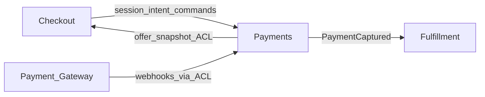

# Architecture (OrderFlow — DDD demo)

Canonical summary for this fictitious repo slice. **Strategic edits** came from a `@domain-modeler.md` pass with trigger: split Sales out of Checkout (see [ADR-0002](adr/0002-split-sales-out-of-checkout.md)).

## Canonical document

- Primary: this file (`docs/architecture.md` relative to the demo folder).
- Domain vocabulary: [domain-glossary.md](domain-glossary.md)

## Context map

| Upstream | Downstream | Pattern | How they communicate |
|----------|------------|---------|----------------------|
| Payments | Checkout | customer-supplier | Versioned **offer snapshot** DTO via `src/checkout/acl/payments-offer-reader.ts` |
| Checkout | Payments | customer-supplier | Submit dedupe + session id for intent creation |
| Payments | Fulfillment | published language | `PaymentCaptured` domain event |

## Anticorruption layers

| External system / neighbour | ACL location | Translates | Forbidden leaks (do not let these reach domain) |
|------------------------------|--------------|------------|-----------------------------------------------------|
| Payment Gateway | `src/lib/payment/acl.ts` | Webhook payloads → **Payment Intent** commands | Raw vendor enums, card PAN |
| Payments offer read model (into Checkout UI) | `src/checkout/acl/payments-offer-reader.ts` | Payments DTO → checkout “banner” view model | **CommercialOffer** internal line types, tax engine ids |

## Layers / boundaries

- **Checkout:** UI + **Customer Session** / **Cart** only; any Payments noun crosses the ACL above.
- **Payments:** **CommercialOffer**, **Payment Intent**, gateway integration.
- **Fulfillment:** **Order** projection from capture — no direct gateway access.
