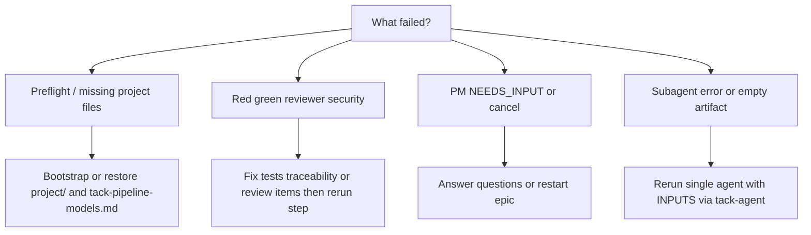

# Tack run / tack agent: errors, stops, and next steps

User-facing guide when the **tack-run** or **tack-agent** skill stops, errors, or confuses the shell **tack** CLI with chat workflows.

---

## What you are actually running

- **`tack run` / `tack agent` in the IDE** refer to the **tack-run** and **tack-agent** skills: the assistant reads prompts from your **consumer** repository (repo-root **`TACK.md`** (canonical), else legacy **`.cursorrules`**, plus `project/`), runs **Preflight** when required, and dispatches **subagents**. Failed steps are **not** auto-retried in the current skill version.
- **The `tack` npm binary** (see the `tack` package `bin/tack.mjs`) implements **`tack doctor`**, **`tack init`**, and **`tack specialist add`** only. It does **not** implement `tack run` or `tack agent`. If the shell says `unknown command` or similar for `tack run`, you meant the **skill** in chat, not the CLI—or you need `tack --help` to see supported subcommands.

**If the failure is the CLI:** run `tack --help` from the repo root and use **`tack doctor`** for environment checks once `project/scripts/tack-doctor.sh` exists (after bootstrap).

---

## Why it stops at the start (Preflight / preconditions)

| Symptom | Typical cause | Next steps |
|--------|----------------|------------|
| Stops at **Preflight** | Missing or incomplete `project/docs/tack-pipeline-models.md` | Run **tack-bootstrap** or restore that file; ensure every pipeline model key required by `project/prompts/auto-orchestrator.md` is present. |
| Stops before any step | **`project/prompts/auto-orchestrator.md` missing** (full pipeline) | Bootstrap the repo or materialize `project/` (e.g. `tack init` plus bootstrap skill). |
| Lacks test/lint commands | **`TACK.md`** (canonical) or legacy **`.cursorrules`** missing or missing `<TEST_COMMAND>` / `<LINT_COMMAND>` | Add **`TACK.md`** at repo root per bootstrap; legacy repos may use **`.cursorrules`** only; gates depend on these for red/green. |

---

## Why the full pipeline stops mid-run (tack-run)

Canonical stop list: `references/stop-conditions.md` in this skill bundle, and the **Stop conditions** section in your repo’s **`project/prompts/auto-orchestrator.md`**.

Common reasons:

1. **Subagent / artifact failure** — A step did not produce the expected file (spec, plan, tests). **Next steps:** Read **Outputs** in `project/prompts/<step>.md`. Re-run **only that step** via **tack-agent** with clearer INPUTS, or fix paths/permissions.

2. **PM Step 1** — **`STATUS: NEEDS_INPUT`** is expected: answer via the orchestrator’s questions. **`cancel grill`** stops the run by design. **Next steps:** Supply answers or restart with a clearer epic.

3. **Gate failures** — **Red gate** (tests should fail after QA red phase but do not), **green gate** (tests still failing), **reviewer FAIL**, **security FAIL**. **Next steps:** Fix tests, spec/plan traceability, or review findings; re-run from the **failed step** (often worker or reviewer), not from zero unless the spec changed.

4. **Spec / traceability** — No valid `project/specs/S-XXX-*.md` with acceptance criteria, or `plan.md` missing **Traceability** for every AC. **Next steps:** Fix files manually or re-run **product-manager** / **architect** with the correct spec id.

5. **Models** — **Model unavailable after upward fallback** (see `references/stop-conditions.md`). **Next steps:** Adjust `project/docs/tack-pipeline-models.md` to models your host supports; retry the step.

6. **Worktree (Step −1)** — Coordinator error, path unusable, or fallback not authorized. **Next steps:** Fix `tack.worktree.*` in repo-root **`TACK.md`** (canonical), or in **`.cursorrules`** only when **`TACK.md`** is absent; use a valid worktree path, or run from the main repo if policy allows.

---

## Doctor / config drift (both `TACK.md` and `.cursorrules`)

If both files exist, scripts and orchestration use **`TACK.md`** only for `tack.worktree.*`, routing, and quality commands. **`bash project/scripts/tack-doctor.sh`** still scans **`.cursorrules`** for leftover `<UPPERCASE_UNFILLED>` tokens so a stale Cursor stub cannot silently drift — remove placeholders there or align with **`TACK.md`**.

---

## Wrong tree / duplicate specs after Step −1

**Symptoms**

- Step −1 succeeded and `worktree_path` exists, but the first pipeline edits (e.g. new spec) appeared in the **primary clone** or IDE workspace root instead of under the linked worktree.
- Duplicate `project/specs/` files or divergent `git status` between main and worktree.

**Why**

- Some hosts ignore **`working_directory` / `cwd`** on the first subagent dispatch; **Step 0** listing may follow the IDE’s default root (often the primary checkout).

**What to do**

- Follow **Wrong-tree detection and recovery** in your consumer **`project/prompts/auto-orchestrator.md`** (dual **`git -C <worktree_path> status`** and **`git -C <repo_root> status`**, reconcile so specs/plan/tests live only in the worktree — remove duplicates from main).
- For the rest of the run: keep **`working_directory`** pinned and prepend the **INPUTS** `cd` / repository-root lines on **every** Step 1–7 / 7b `Task` per **Dispatch protocol** in that file.

---

## Why a single agent fails (tack-agent)

| Symptom | Cause | Next steps |
|--------|--------|------------|
| “Prompt not found” | **`project/prompts/<name>.md` missing** | List `project/prompts/*.md`; use an existing agent or **`tack specialist add <slug>`** after bootstrap. |
| Wrong or missing model | **`tack-pipeline-models.md` incomplete** for that key | Fix `project/docs/tack-pipeline-models.md`; the skill may warn and use fallback. |
| Incomplete result | **INPUTS not gathered** (e.g. architect without spec path, reviewer without diff scope) | Re-invoke with explicit paths, epic, or `git diff` scope. |
| Ambiguous role | Agent not specified | Use the orchestrator’s **AskQuestion** flow or pick **full pipeline → tack-run**. |

---

## Design policy (not a bug)

- **No auto-retry** — A failed step ends the run. The **Final report** should record **`STOPPED at Step N — reason`**. Fix the cause, then continue from that step or re-dispatch one agent.
- **Step 8 / 9 (PR / worktree cleanup)** — Failures update report lines only; they do not change the main pipeline success flag (per tack-run skill execution outline).

---

## Checklist when something breaks

1. Read the **Final report** line: **`STOPPED at Step N`** or **`STOPPED at Preflight`**.
2. Open **`project/prompts/auto-orchestrator.md`** for the gate tied to that step.
3. Recover with **tack-agent** and corrected INPUTS, or full **tack-run** after fixing artifacts.
4. Run **`tack doctor`** (once bootstrapped) to validate paths and commands.

---

## Mapping **STOPPED** to the right doc (quick reference)

| Report says | Open first |
|-------------|------------|
| `STOPPED at Preflight` | `project/docs/tack-pipeline-models.md` and Preflight in `auto-orchestrator.md` |
| `STOPPED at Step 1` | `project/prompts/product-manager.md`, spec under `project/specs/` |
| Red/green/reviewer/security | That step’s prompt under `project/prompts/`, plus `auto-orchestrator.md` gates |

---

## Shell vs chat (again)

| You tried | What it is |
|-----------|------------|
| `tack run` in **terminal** | Not a CLI subcommand in stock `tack`; use the **tack-run** skill in chat, or run the orchestrator workflow manually. |
| `tack agent` in **terminal** | Same: use the **tack-agent** skill in chat for one step. |
| `tack doctor` | Valid CLI — checks bootstrapped **project/** layout and tooling when the script exists. |
