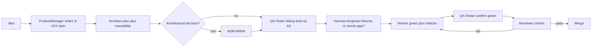

# Tack

> Spec-driven, multi-agent discipline for coding agents.

Tack turns a coding agent loose on your repo into a deterministic pipeline: numbered specs, failing tests before code, and isolated agent roles (PM → architect → QA → worker → reviewer) so features ship traceably end-to-end.

It's a **template, not a runtime** — install three small skills, run a one-time bootstrap on your repo, and ship features through the pipeline. Works across **Claude Code, Cursor, GitHub Copilot CLI, Codex, and Antigravity**; bootstrap detects which editor skill paths to populate (**`tack.agents.active`**) and writes repo-root **`TACK.md`** as the single Tack config (commands, worktrees, SDD entry points) — you don't pick a platform up front.

**Portuguese (Brazil):** [README.pt-BR.md](README.pt-BR.md)

## The three skills

| Skill | When to use | Frequency |
|---|---|---|
| [`tack-bootstrap`](skills/tack-bootstrap/SKILL.md) | First time in a repo: 6-phase interview that fills project-rules files, `project/docs/`, role prompts, and routing | Once per repo |
| [`tack-run`](skills/tack-run/SKILL.md) | Ship a feature end-to-end (epic → spec → plan → red → green → reviewer) | Per feature |
| [`tack-agent`](skills/tack-agent/SKILL.md) | Invoke a single role: reviewer pass on a diff, `diagnose` a regression, `event-stormer` for greenfield DDD storming, `domain-modeler` to refine bounded contexts | Ad hoc |

## Pipeline at a glance

End-to-end feature work follows this role sequence (step through role prompts or run `tack-run`).



Full numbered lifecycle, orchestrators, and optional worktree coordination live in [`skills/tack-bootstrap/template/docs/sdd.md`](skills/tack-bootstrap/template/docs/sdd.md).

## Quick start

### New repo from this template

Use this flow when you want a **fresh repository** (no fork link to upstream):

- On GitHub: open this repository and choose **Use this template**, then create your new repo from the dialog.
- With [GitHub CLI](https://cli.github.com/): `gh repo create my-app --template jpmmatias/tack-scaffolding --private` (pick your name and visibility).

Then continue with **Install the skills** and **`tack-bootstrap`** below on that new checkout.

### 1. Install the skills into your agent

Recommended — [`npx skills`](https://skills.sh/) installs into your agent's expected path automatically:

```bash
cd /path/to/your/repo
npx skills add jpmmatias/tack-scaffolding
```

Or copy `skills/tack-bootstrap/` manually into:

| Agent / editor        | Path |
|----------------------|------|
| Claude Code          | `.claude/skills/tack-bootstrap/` |
| Cursor               | `.cursor/skills/tack-bootstrap/` |
| Antigravity (project)| `.agents/skills/tack-bootstrap/` |

> **Note.** `npx skills add` installs the skill into your *agent's* path. The bootstrap step below materializes **`project/`** and repo-root **`TACK.md`** in your *target repo*. Two different mechanisms.

### 2. Bootstrap your repo

Open your agent and ask it to run **`tack-bootstrap`** (or describe the task: "bootstrap Tack on this repo / fill the project-rules files and `project/docs/`").

The 6-phase interview detects your stack and the agent surfaces in use, then writes:

- `project/` — prompts, docs, specs, scripts, ADR template
- **Repo-root `TACK.md`** — canonical quality commands, `tack.worktree.*`, `tack.routing.*`, SDD entry points (skills vs `@` mentions), invariants
- `tack-run` / `tack-agent` skill mirrors under `.claude/skills/`, `.agents/skills/`, `.cursor/skills/` — whichever surfaces apply

Phase 2 mines business rules from existing code; Phase 5 writes the artifacts; Phase 6 runs `bash project/scripts/tack-doctor.sh` to verify no placeholders are left.

#### Phase 1 detection (summary)

The Phase 1 interview treats **which agent surfaces get scaffolding** (`tack.agents.active`) and the optional **DDD profile** (`tack.ddd.profile = on | off`, default **off**) as first-class outputs alongside stack detection. With `tack.ddd.profile = on`, later phases add bounded-context mining, DDD sections in glossary/architecture/spec template, optional **`@event-stormer.md`** (greenfield / no Phase 2 **(ddd)** draft), and optional **`@domain-modeler`**. Full detail: [`skills/tack-bootstrap/SKILL.md`](skills/tack-bootstrap/SKILL.md) → *Phase 1 — Detect context* and behavior rule 13.

### Optional — `tack` CLI

This repository exposes a small **`tack`** binary ([`bin/tack.mjs`](bin/tack.mjs)) for bootstrapped repos and local experimentation. It does **not** replace the **`tack-bootstrap`** interview (routing, mirrors, filled docs).

From a clone of this repo:

```bash
npm link          # puts `tack` on your PATH (omit if you only use npx)
tack --help
```

Typical subcommands:

| Command | Purpose |
|---------|---------|
| `tack doctor` | Runs `project/scripts/tack-doctor.sh` in the current repo (placeholder checks). Same as `bash project/scripts/tack-doctor.sh`. |
| `tack init` | Copies the stock [`skills/tack-bootstrap/template/`](skills/tack-bootstrap/template/) tree into `./project` (use `--target DIR` for another root; `--force` replaces an existing `project/`). |
| `tack specialist add <slug>` | Copies the specialist prompt stub to `project/prompts/<slug>.md`; you still wire [`auto-orchestrator.md`](skills/tack-bootstrap/template/prompts/auto-orchestrator.md) Specialist rows yourself. |

You can also run `node bin/tack.mjs …` without linking. Publishing to npm is optional (`private` remains true in [`package.json`](package.json)); `npm pack` runs **`prepack`**, which snapshots `skills/tack-bootstrap/template` into **`pkg/template`** for installs.

### 3. Ship a feature

Paste an epic and ask your agent to run **`tack-run`**:

```text
Run tack-run for this epic:
"As a customer I want to cancel an order before it ships so I can…"
```

The skill reads `project/prompts/auto-orchestrator.md` and dispatches each role as an isolated subagent. You get a spec (`S-XXX`), failing tests (red), passing implementation (green), and a reviewer report — with `S-XXX` / `AC-N` traceability throughout.

### 4. One-off agent invocations

For tasks that don't need the full pipeline:

```text
Run tack-agent reviewer on this diff
Run tack-agent diagnose for the flaky test in tests/orders_spec.rb
Run tack-agent event-stormer after Phase 3 Block A DDD Round 1 for a new repo
Run tack-agent domain-modeler to refine the Billing context
```

## Troubleshooting

Mirror drift, `git worktree` / sandbox issues, bootstrap Phase 2 gates, empty specialist routing, model routing, and orchestrator stop reasons are covered in [docs/FAQ.md](docs/FAQ.md).

## When to use Tack

**Reach for Tack when:**

- You're starting a project where you want spec discipline locked in from day one.
- You have defined domain rules, vocabulary, and multiple stakeholders who need a shared glossary.
- You already write tests and want agents to honor TDD instead of skipping it.
- Multiple agents or contributors work in parallel and you want isolated worktrees and traceable commits.

**Skip Tack (or use only `tack-agent` ad hoc) when:**

- It's a throwaway script, prototype, or one-shot tool — the spec → plan → red → green → review loop is overhead you'll pay every time.
- The change is a typo, one-liner, or trivial fix — invoke `tack-agent` for a single role instead of `tack-run`.
- The repo has no test harness yet — bootstrap expects a test and lint command to exist; build them first if neither does.
- The team isn't willing to write specs — without a real spec, QA can't write meaningful ACs and the reviewer gate loses rigor.
- The codebase has no domain to speak of (CRUD over a single table, a static site) — the glossary, ADRs, and DDD profile are dead weight.

## Philosophy

Tack is a set of constraints that turn an agent loose on your repo into a disciplined process. The principles below aren't aspirational; they're enforced by the prompts and **`TACK.md`** the bootstrap writes at the repo root.

- **Specs before code, with traceability.** Numbered `S-XXX` specs with Gherkin `AC-N` are the unit of truth; tasks in `plan.md` map to closed ACs; commits cite `S-XXX#AC-N` so history is queryable. (see [`skills/tack-bootstrap/template/docs/sdd.md`](skills/tack-bootstrap/template/docs/sdd.md))
- **TDD red-green gate, enforced by the reviewer.** Failing tests are written before implementation; the reviewer role checks the gate is real, not a rubber-stamp. (see [`skills/tack-bootstrap/template/prompts/qa-tester.md`](skills/tack-bootstrap/template/prompts/qa-tester.md), [`reviewer.md`](skills/tack-bootstrap/template/prompts/reviewer.md))
- **Role isolation prevents context bleed.** Each role runs as a separate subagent in sequence (PM, architect, QA, harness engineer, worker, reviewer, security), so no single agent mixes concerns. (see [`skills/tack-bootstrap/template/prompts/`](skills/tack-bootstrap/template/prompts/))
- **Harness as feedforward + feedback.** Project-rules files guide agents *before* they write code; tests, lint, type checks, and the reviewer validate *after*. Both halves are the harness. (see [`skills/tack-bootstrap/template/docs/harness-engineering.md`](skills/tack-bootstrap/template/docs/harness-engineering.md))
- **Decisions in ADRs, vocabulary in a glossary.** Hard-to-reverse choices land in `ADR-NNNN`; canonical terms and forbidden synonyms live in `domain-glossary.md` and are law for every role. (see [`skills/tack-bootstrap/template/docs/domain-glossary.md`](skills/tack-bootstrap/template/docs/domain-glossary.md))
- **Parallel features without clobbering.** Optional `git worktree` mode reserves `S-XXX` across branches so multiple features run in isolated trees. (see [`tack-worktree.sh`](skills/tack-bootstrap/template/scripts/tack-worktree.sh))
- **Agent-agnostic by construction.** The same prompts drive Claude Code, Cursor, Copilot CLI, Codex, and Antigravity; opt-in profiles (auto-routing, DDD) keep the surface area honest.

The philosophy lives in prompts and your project-rules files, not in tooling — after bootstrap, `project/docs/sdd.md` and the rules files at the repo root are where the rules are written down for your repo.

## What's in the bundled template

After Phase 5, your consumer repo has under `project/`:

| Path | Purpose |
|------|---------|
| `project/TACK.md.template` | Filled as **`TACK.md`** at repo root during bootstrap (quality commands, `tack.worktree.*`, `tack.routing.*`, SDD entry points, invariants). |
| `project/.cursorrules.template` | Legacy stub only (deprecated — not written by bootstrap; use **`TACK.md`**). |
| `project/docs/sdd.md` | SDD lifecycle, 7-step pipeline, **Multi-platform agent support** (single-chat inlining, `/agents` vs prompt files, orchestrator preamble), and **Parallel features** (`git worktree`). |
| `project/scripts/tack-worktree.sh` | Create/list/remove linked worktrees + reserve `S-XXX` across branches (reads **`TACK.md`** defaults). |
| `project/scripts/splice-tack-routing.sh` | Deprecated helper for old `AGENTS.md` / `CLAUDE.md` splices (manual migration only). |
| `project/scripts/tack-doctor.sh` | Post-bootstrap validator: repo-root **`TACK.md`** (default) or `--rules`; fails on leftover `<UPPERCASE>` placeholders and `<fill>` rows in routing tables. |
| `project/docs/harness-engineering.md` | Guides vs sensors, steering loop. |
| `project/docs/test-harness.md` | Test harness intent and boundary doubles. |
| `project/docs/domain-glossary.md` | Skeleton glossary — **must** be filled for your domain. |
| `project/docs/architecture.md` | Canonical architecture doc placeholder. |
| `project/docs/adr/_template.md` | ADR template. |
| `project/prompts/*.md` | Role prompts: PM, architect, QA, harness engineer, worker, reviewer, security, orchestrators. |
| `project/prompts/_specialist-template.md` | Duplicate for stack-specific roles. |
| `project/specs/_template.md` | Product spec template. |
| `project/examples/` | Fictitious **OrderFlow** examples (`orderflow-full/` SDD slice, `orderflow-ddd/` DDD boundary walkthrough — see [`skills/tack-bootstrap/template/examples/`](skills/tack-bootstrap/template/examples/README.md)). |

## Multi-platform agent support

Tack ships one canonical `auto-orchestrator.md` written with **Cursor** tool names (`Task`, `AskQuestion`, `working_directory`, `subagent_type: generalPurpose`). It also carries a **Platform tool mapping** preamble translating those names to **Claude Code**, **Copilot CLI**, **Codex**, and **Antigravity**, so the same prompt drives any subagent-capable host.

| Concept | Cursor | Claude Code | Other / generic |
|---------|--------|-------------|-----------------|
| Dispatch a subagent | `Task` | `Agent` (a.k.a. `Task` in older builds) | host-specific subagent primitive |
| Subagent type | `subagent_type: generalPurpose` | `subagent_type: general-purpose` | omit when unsupported |
| Pinned working dir | `working_directory` | `cwd` (or `cd <path> && …` in the prompt) | host-specific; otherwise prepend `cd <worktree_path>` |
| Ask the human | `AskQuestion` | `AskUserQuestion` | post the question in chat verbatim |

The `tack-run` / `tack-agent` skills do this translation when called via the host's skill system. For details see [`skills/tack-bootstrap/template/prompts/auto-orchestrator.md`](skills/tack-bootstrap/template/prompts/auto-orchestrator.md) → **Platform tool mapping**.

**Common pitfalls:** the lead chat may run the whole pipeline **inline** (no per-step `Task` / `Agent`), and UIs such as **Claude Code `/agents`** are **not** Tack’s role pack — each step should still **embed the full** `project/prompts/<name>.md` per **Dispatch protocol** in `auto-orchestrator.md`. Optional **orchestrator-only** epic preamble, library-vs-files clarity, and fallbacks (`@orchestrator.md`, stepwise `tack-agent`) live in [`skills/tack-bootstrap/template/docs/sdd.md`](skills/tack-bootstrap/template/docs/sdd.md) → **Multi-platform agent support** (copied to `project/docs/sdd.md` after bootstrap).

## Conventions (summary)

- **Specs:** `S-001`, `S-002`, … — files `project/specs/S-XXX-<slug>.md`.
- **ACs:** `AC-1`, `AC-2`, … in Gherkin inside the spec.
- **Plans:** `plan.md` with first line `Spec: S-XXX` and a `## Traceability` table (tasks ↔ ACs).
- **ADRs:** `ADR-0001`, … — files under `project/docs/adr/`.
- **Commits / PRs:** cite `S-XXX` and closed `AC-N` where applicable (e.g. `Closes: S-001#AC-1`).

## Listing on skills.sh

This repo follows the multi-skill layout (`skills/<name>/SKILL.md`) expected by the [Vercel skills CLI](https://vercel.com/docs/agent-resources/skills). To appear in the public directory, submit or update metadata via [skills.sh](https://skills.sh/) (community registry).

## Contributing

Working on Tack itself? See [CONTRIBUTING.md](CONTRIBUTING.md) — covers the canonical skill location under `skills/`, the `npm run sync` mirror workflow, and CI checks. See also [docs/FAQ.md](docs/FAQ.md) for common failures (mirrors, worktrees, bootstrap, orchestrator stops).

## References

- [Harness engineering for coding agent users](https://martinfowler.com/articles/harness-engineering.html) (Böckeler, martinfowler.com)

## License

MIT — see [LICENSE](LICENSE).
