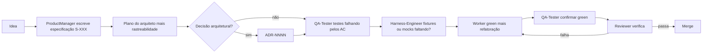

# Tack

> Disciplina orientada a especificação e multiagente para agentes de código.

O Tack é um **conjunto modelo** para desenvolvimento orientado por especificações com agentes de código—não um runtime hospedado. Um **bootstrap** único escreve **`project/`** e o **`TACK.md`** na raiz (comandos de qualidade, worktrees, roteamento SDD). O **`tack-run`** conduz papéis isolados para que o trabalho vá de **especificação → plano → testes falhando → implementação → reviewer** de ponta a ponta, com rastreabilidade **`S-XXX` / `AC-N`**.

Os mesmos prompts funcionam em **Claude Code, Cursor, GitHub Copilot CLI, Codex e Antigravity**. O bootstrap escolhe os caminhos de instalação das skills (**`tack.agents.active`**); você não fixa um fornecedor com antecedência.

[](LICENSE)
[](https://nodejs.org/)
[](https://github.com/jpmmatias/tack-scaffolding/actions/workflows/check.yml)
[](https://skills.sh/)

**English version:** [README.md](README.md)

**Estado do projeto:** [](https://github.com/jpmmatias/tack-scaffolding/actions/workflows/check.yml) · [CONTRIBUTING.md](CONTRIBUTING.md) · [docs/FAQ.md](docs/FAQ.md)

## Índice

- [Por que o Tack?](#por-que-o-tack)
- [O que você ganha](#o-que-você-ganha)
- [Pré-requisitos](#pré-requisitos)
- [As três skills](#as-três-skills)
- [Pipeline em resumo](#pipeline-em-resumo)
- [Começando](#começando)
- [Solução de problemas](#solução-de-problemas)
- [Quando usar o Tack](#quando-usar-o-tack)
- [Filosofia](#filosofia)
- [O que vem no modelo empacotado](#o-que-vem-no-modelo-empacotado)
- [Suporte multiplataforma a agentes](#suporte-multiplataforma-a-agentes)
- [Convenções (resumo)](#convenções-resumo)
- [Listagem em skills.sh](#listagem-em-skillssh)
- [Contribuir](#contribuir)
- [Referências](#referências)
- [Licença](#licença)

## Por que o Tack?

**Sem um harness repetível**, agentes improvisando no mesmo repositório pulam especificações, pulam TDD de verdade e misturam papéis — e os merges perdem rastreabilidade até aos critérios de aceitação.

**Com o Tack**, você fixa especificações numeradas (**`S-XXX`**), ACs em Gherkin (**`AC-N`**), subagentes isolados (**`tack-run`**) e um único **`TACK.md`** na raiz para comandos e roteamento — assim a entrega fica auditável, não só conversacional.

## O que você ganha

- **Especificações e ACs** — arquivos `S-XXX` com `AC-N` em Gherkin; planos e commits citam isso.
- **`tack-bootstrap`** — entrevista em seis fases: detecção de stack, perfil DDD opcional (`tack.ddd.profile`), `project/` e **`TACK.md`** preenchidos.
- **`tack-run`** — épico → especificação → plano → red → green → reviewer via `project/prompts/auto-orchestrator.md`.
- **`tack-agent`** — papéis pontuais (reviewer, diagnose, event-stormer, domain-modeler, …).
- **Portões de qualidade** — testes falhando antes da implementação; o reviewer valida o portão.
- **`tack-doctor`** — detecta placeholders sobrando no **`TACK.md`** e nas tabelas de roteamento após o bootstrap.
- **Funcionalidades paralelas (opcional)** — `git worktree` + **`tack-worktree.sh`** para reservar `S-XXX` entre branches.
- **Instalação multi‑editor** — skills espelhadas em `.claude/`, `.cursor/`, `.agents/` conforme o bootstrap detecta.
- **CLI opcional `tack`** — `doctor`, `init`, `specialist add` ([`bin/tack.mjs`](bin/tack.mjs)); **não** substitui a entrevista de bootstrap.

## Pré-requisitos

- **Node.js 18+** — para `npm pack`, `npm link` e tooling neste repositório ([`package.json`](package.json)); opcional nos repositórios consumidores que só instalam skills com `npx skills`.
- **Repositório alvo:** comandos funcionais de **teste** e **lint** (ou equivalentes) que o bootstrap possa registrar em **`TACK.md`**; adicione um harness mínimo primeiro se algo faltar ([Quando usar o Tack](#quando-usar-o-tack)).
- **Agente de código** que consiga rodar skills e subagentes — ou siga os padrões de fallback do orquestrador em **`project/docs/sdd.md`** após o bootstrap.

## As três skills

| Skill | Quando usar | Frequência |
|---|---|---|
| [`tack-bootstrap`](skills/tack-bootstrap/SKILL.md) | Primeira vez no repositório: entrevista em 6 fases que preenche arquivos de regras do projeto, `project/docs/`, prompts de papéis e roteamento | Uma vez por repositório |
| [`tack-run`](skills/tack-run/SKILL.md) | Entregar uma funcionalidade de ponta a ponta (épico → especificação → plano → red → green → reviewer) | Por funcionalidade |
| [`tack-agent`](skills/tack-agent/SKILL.md) | Invocar um único papel: passagem do reviewer em um diff, `diagnose` em uma regressão, `event-stormer` para DDD em greenfield, `domain-modeler` para refinar contextos delimitados | Sob demanda |

## Pipeline em resumo

O trabalho de funcionalidade de ponta a ponta segue esta sequência de papéis (percorra os prompts de cada papel ou execute `tack-run`).



Ciclo de vida numerado completo, orquestradores e coordenação opcional com worktree estão em [`skills/tack-bootstrap/template/docs/sdd.md`](skills/tack-bootstrap/template/docs/sdd.md).

## Começando

Cerca de **cinco minutos** depois que você já tem um checkout do repositório (modelo novo ou projeto existente): instalar skills, rodar **`tack-bootstrap`** e então entregar épicos com **`tack-run`**.

### Novo repositório a partir deste modelo

Use quando quiser um **repositório novo** (sem vínculo de fork com o upstream):

- No GitHub: abra este repositório e escolha **Use this template**, depois crie o novo repositório no fluxo.
- Com [GitHub CLI](https://cli.github.com/): `gh repo create my-app --template jpmmatias/tack-scaffolding --private` (ajuste nome e visibilidade).

Em seguida siga **Instalar as skills** e **`tack-bootstrap`** abaixo nesse checkout.

### 1. Instalar as skills no seu agente

Recomendado — [`npx skills`](https://skills.sh/) instala no caminho esperado pelo agente:

```bash
cd /caminho/do/seu/repo
npx skills add jpmmatias/tack-scaffolding
```

Ou copie `skills/tack-bootstrap/` manualmente para:

| Agente / editor        | Caminho |
|----------------------|------|
| Claude Code          | `.claude/skills/tack-bootstrap/` |
| Cursor               | `.cursor/skills/tack-bootstrap/` |
| Antigravity (projeto)| `.agents/skills/tack-bootstrap/` |

> **Nota.** `npx skills add` instala a skill no caminho do *agente*. O passo de bootstrap abaixo materializa **`project/`** e o **`TACK.md`** na raiz do *repositório alvo*. São dois mecanismos diferentes.

### 2. Fazer bootstrap do repositório

Abra o agente e peça para rodar **`tack-bootstrap`** (ou descreva a tarefa: “fazer bootstrap do Tack neste repositório / preencher os arquivos de regras do projeto e `project/docs/`”).

A entrevista em 6 fases detecta sua stack e as superfícies de agente em uso; em seguida escreve:

- `project/` — prompts, documentos, especificações, scripts, modelo de ADR
- **`TACK.md` na raiz** — comandos de qualidade canônicos, `tack.worktree.*`, `tack.routing.*`, entradas SDD (skills vs menções `@`), invariantes
- Espelhos das skills `tack-run` / `tack-agent` em `.claude/skills/`, `.agents/skills/`, `.cursor/skills/` — conforme as superfícies aplicáveis

A Fase 2 extrai regras de negócio do código existente; a Fase 5 grava os artefatos; a Fase 6 executa `bash project/scripts/tack-doctor.sh` para verificar que não restaram placeholders.

#### Fase 1 — detecção (resumo)

A entrevista da Fase 1 trata **quais superfícies de agente recebem scaffolding** (`tack.agents.active`) e o perfil opcional de **DDD** (`tack.ddd.profile = on | off`, padrão **off**) como saídas de primeira classe, junto com a detecção de stack. Com `tack.ddd.profile = on`, fases seguintes acrescentam mineração de contextos delimitados, seções DDD em glossário/arquitetura/modelo de spec, **`@event-stormer.md`** opcional (greenfield / sem rascunho **(ddd)** da Fase 2) e **`@domain-modeler`** opcional. Detalhes: [`skills/tack-bootstrap/SKILL.md`](skills/tack-bootstrap/SKILL.md) → *Fase 1 — Detectar contexto* e regra de comportamento 13.

### Opcional — CLI `tack`

Este repositório expõe um binário pequeno **`tack`** ([`bin/tack.mjs`](bin/tack.mjs)) para repositórios bootstrados e experimentação local. Ele **não** substitui a entrevista **`tack-bootstrap`** (roteamento, espelhos, documentos preenchidos).

Num clone deste repositório:

```bash
npm link          # disponibiliza `tack` no PATH (omitir se usar só npx)
tack --help
```

Subcomandos típicos:

| Comando | Finalidade |
|---------|---------|
| `tack doctor` | Executa `project/scripts/tack-doctor.sh` no repositório atual (checagem de placeholders). Igual a `bash project/scripts/tack-doctor.sh`. |
| `tack init` | Copia a árvore [`skills/tack-bootstrap/template/`](skills/tack-bootstrap/template/) para `./project` (use `--target DIR` para outra raiz; `--force` substitui um `project/` existente). |
| `tack specialist add <slug>` | Copia o stub de prompt especialista para `project/prompts/<slug>.md`; você mesmo liga linhas **Specialist** em [`auto-orchestrator.md`](skills/tack-bootstrap/template/prompts/auto-orchestrator.md). |

Também dá para `node bin/tack.mjs …` sem linking. Publicar no npm é opcional (`private` permanece true em [`package.json`](package.json)); `npm pack` executa **`prepack`**, que faz snapshot de `skills/tack-bootstrap/template` em **`pkg/template`** para instaladores.

### 3. Entregar uma funcionalidade

Cole um épico e peça ao agente para rodar **`tack-run`**:

```text
Run tack-run for this epic:
"As a customer I want to cancel an order before it ships so I can…"
```

A skill lê `project/prompts/auto-orchestrator.md` e despacha cada papel como subagente isolado. Você obtém uma especificação (`S-XXX`), testes falhando (red), implementação passando (green) e um relatório do reviewer — com rastreabilidade `S-XXX` / `AC-N` em todo o fluxo.

### 4. Invocações pontuais do agente

Para tarefas que não precisam do pipeline completo:

```text
Run tack-agent reviewer on this diff
Run tack-agent diagnose for the flaky test in tests/orders_spec.rb
Run tack-agent event-stormer after Phase 3 Block A DDD Round 1 for a new repo
Run tack-agent domain-modeler to refine the Billing context
```

## Solução de problemas

Deriva de espelhos, `git worktree` / sandbox, portões da Fase 2 do bootstrap, roteamento vazio de especialistas, roteamento de modelo e motivos de parada do orquestrador estão em [docs/FAQ.md](docs/FAQ.md).

## Quando usar o Tack

**Use o Tack quando:**

- Você está começando um projeto em que quer disciplina de especificação desde o primeiro dia.
- Você tem regras de domínio, vocabulário e várias partes interessadas que precisam de um glossário compartilhado.
- Você já escreve testes e quer que os agentes respeitem TDD em vez de pular.
- Vários agentes ou contribuidores trabalham em paralelo e você quer worktrees isolados e commits rastreáveis.

**Evite o Tack (ou use só `tack-agent` pontual) quando:**

- É um script descartável, protótipo ou ferramenta de uso único — o ciclo especificação → plano → red → green → revisão é custo que você paga sempre.
- A mudança é um typo, uma linha ou correção trivial — invoque `tack-agent` para um único papel em vez de `tack-run`.
- O repositório ainda não tem harness de testes — o bootstrap espera que existam comandos de teste e lint; construa-os primeiro se faltar algum.
- O time não está disposto a escrever especificações — sem especificação real, o QA não consegue ACs significativos e o gate do reviewer perde rigor.
- O código não tem domínio de verdade (CRUD em uma tabela, site estático) — glossário, ADRs e perfil DDD viram peso morto.

## Filosofia

O Tack é um conjunto de restrições que transformam um agente solto no repositório em um processo disciplinado. Os princípios abaixo não são aspiracionais; são aplicados pelos prompts e pelo **`TACK.md`** que o bootstrap grava na raiz do repositório.

- **Especificações antes do código, com rastreabilidade.** Especificações numeradas `S-XXX` com `AC-N` em Gherkin são a unidade de verdade; tarefas em `plan.md` mapeiam ACs fechados; commits citam `S-XXX#AC-N` para histórico consultável. (ver [`skills/tack-bootstrap/template/docs/sdd.md`](skills/tack-bootstrap/template/docs/sdd.md))
- **Portão TDD red-green, aplicado pelo reviewer.** Testes falhando são escritos antes da implementação; o papel de reviewer verifica se o portão é real. (ver [`skills/tack-bootstrap/template/prompts/qa-tester.md`](skills/tack-bootstrap/template/prompts/qa-tester.md), [`reviewer.md`](skills/tack-bootstrap/template/prompts/reviewer.md))
- **Isolamento de papéis evita mistura de contexto.** Cada papel roda como subagente separado em sequência (PM, arquiteto, QA, harness engineer, worker, reviewer, segurança). (ver [`skills/tack-bootstrap/template/prompts/`](skills/tack-bootstrap/template/prompts/))
- **Harness como antecipação + feedback.** Os arquivos de regras guiam os agentes *antes* de escrever código; testes, lint, checagens de tipo e o reviewer validam *depois*. As duas metades formam o harness. (ver [`skills/tack-bootstrap/template/docs/harness-engineering.md`](skills/tack-bootstrap/template/docs/harness-engineering.md))
- **Decisões em ADRs, vocabulário no glossário.** Escolhas difíceis de reverter vão para `ADR-NNNN`; termos canônicos e sinônimos proibidos ficam em `domain-glossary.md` e são lei para todo papel. (ver [`skills/tack-bootstrap/template/docs/domain-glossary.md`](skills/tack-bootstrap/template/docs/domain-glossary.md))
- **Funcionalidades paralelas sem atropelar.** O modo opcional `git worktree` reserva `S-XXX` entre branches para várias funcionalidades em árvores isoladas. (ver [`tack-worktree.sh`](skills/tack-bootstrap/template/scripts/tack-worktree.sh))
- **Agnóstico de agente por construção.** Os mesmos prompts servem a Claude Code, Cursor, Copilot CLI, Codex e Antigravity; perfis opcionais (roteamento automático, DDD) mantêm a superfície honesta.

A filosofia vive nos prompts e nas regras do projeto, não em ferramentas — após o bootstrap, `project/docs/sdd.md` e o **`TACK.md`** na raiz são onde as regras ficam escritas para o seu projeto.

## O que vem no modelo empacotado

Depois da Fase 5, o repositório consumidor tem sob `project/`:

| Caminho | Finalidade |
|------|---------|
| `project/TACK.md.template` | Preenchido como **`TACK.md`** na raiz no bootstrap (comandos de qualidade, `tack.worktree.*`, `tack.routing.*`, entradas SDD, invariantes). |
| `project/.cursorrules.template` | Legado apenas (obsoleto — o bootstrap não grava isso na raiz; use **`TACK.md`**). |
| `project/docs/sdd.md` | Ciclo de vida SDD, pipeline em 7 passos, **Suporte multiplataforma a agentes** (inlining em um único chat, `/agents` vs arquivos de prompt, preâmbulo do orquestrador) e **Funcionalidades paralelas** (`git worktree`). |
| `project/scripts/tack-worktree.sh` | Criar/listar/remover worktrees ligados e reservar `S-XXX` entre branches (lê padrões em **`TACK.md`**). |
| `project/scripts/splice-tack-routing.sh` | Helper obsoleto para antigos splices em `AGENTS.md` / `CLAUDE.md` (apenas migração manual). |
| `project/scripts/tack-doctor.sh` | Validador pós-bootstrap: **`TACK.md`** na raiz por padrão ou `--rules`; falha com placeholders `<UPPERCASE>` e linhas `<fill>` nas tabelas de roteamento. |
| `project/docs/harness-engineering.md` | Guias versus sensores, laço de direção. |
| `project/docs/test-harness.md` | Intenção do harness de testes e doubles de fronteira. |
| `project/docs/domain-glossary.md` | Esqueleto do glossário — **deve** ser preenchido para o seu domínio. |
| `project/docs/architecture.md` | Placeholder do documento de arquitetura canônico. |
| `project/docs/adr/_template.md` | Modelo de ADR. |
| `project/prompts/*.md` | Prompts de papéis: PM, arquiteto, QA, harness engineer, worker, reviewer, segurança, orquestradores. |
| `project/prompts/_specialist-template.md` | Duplicar para papéis específicos da stack. |
| `project/specs/_template.md` | Modelo de especificação de produto. |
| `project/examples/` | Exemplos fictícios **OrderFlow** (`orderflow-full/` fatia SDD, `orderflow-ddd/` walkthrough de limites DDD — ver [`skills/tack-bootstrap/template/examples/`](skills/tack-bootstrap/template/examples/README.md)). |

## Suporte multiplataforma a agentes

O Tack envia um `auto-orchestrator.md` canônico escrito com nomes de ferramentas do **Cursor** (`Task`, `AskQuestion`, `working_directory`, `subagent_type: generalPurpose`). Ele também traz um preâmbulo **Mapeamento de ferramentas por plataforma** que traduz esses nomes para **Claude Code**, **Copilot CLI**, **Codex** e **Antigravity**, para que o mesmo prompt funcione em qualquer host com subagentes.

| Conceito | Cursor | Claude Code | Outro / genérico |
|---------|--------|-------------|-----------------|
| Despachar subagente | `Task` | `Agent` (ou `Task` em builds antigos) | primitiva específica do host |
| Tipo de subagente | `subagent_type: generalPurpose` | `subagent_type: general-purpose` | omitir quando não suportado |
| Diretório fixo | `working_directory` | `cwd` (ou `cd <path> && …` no prompt) | específico do host; senão prefixar `cd <worktree_path>` |
| Perguntar ao humano | `AskQuestion` | `AskUserQuestion` | postar a pergunta no chat literalmente |

As skills `tack-run` / `tack-agent` fazem essa tradução quando invocadas pelo sistema de skills do host. Detalhes em [`skills/tack-bootstrap/template/prompts/auto-orchestrator.md`](skills/tack-bootstrap/template/prompts/auto-orchestrator.md) → **Platform tool mapping**.

**Armadilhas comuns:** o chat líder pode executar o pipeline inteiro **em linha** (sem um `Task` / `Agent` por passo), e interfaces como **`/agents` do Claude Code** **não** são o pacote de papéis do Tack — cada passo deve ainda assim **incorporar o arquivo completo** `project/prompts/<nome>.md` conforme **Dispatch protocol** em `auto-orchestrator.md`. Preâmbulo épico apenas no orquestrador, biblioteca-vs-arquivos e fallbacks (`@orchestrator.md`, `tack-agent` passo a passo) estão em [`skills/tack-bootstrap/template/docs/sdd.md`](skills/tack-bootstrap/template/docs/sdd.md) → **Multi-platform agent support** (copiado para `project/docs/sdd.md` após o bootstrap).

## Convenções (resumo)

- **Especificações:** `S-001`, `S-002`, … — arquivos `project/specs/S-XXX-<slug>.md`.
- **ACs:** `AC-1`, `AC-2`, … em Gherkin dentro da especificação.
- **Planos:** `plan.md` com primeira linha `Spec: S-XXX` e tabela `## Traceability` (tarefas ↔ ACs).
- **ADRs:** `ADR-0001`, … — arquivos em `project/docs/adr/`.
- **Commits / PRs:** citar `S-XXX` e `AC-N` fechados quando aplicável (ex.: `Closes: S-001#AC-1`).

## Listagem em skills.sh

Este repositório segue o layout multi-skill (`skills/<name>/SKILL.md`) esperado pela [CLI skills da Vercel](https://vercel.com/docs/agent-resources/skills). Para aparecer no diretório público, envie ou atualize metadados via [skills.sh](https://skills.sh/) (registro da comunidade).

## Contribuir

Trabalhando no próprio Tack? Veja [CONTRIBUTING.md](CONTRIBUTING.md) — cobre o local canônico das skills em `skills/`, o fluxo de espelhamento `npm run sync` e checagens de CI. Veja também [docs/FAQ.md](docs/FAQ.md) para falhas comuns (espelhos, worktrees, bootstrap, paradas do orquestrador).

## Referências

- [Harness engineering for coding agent users](https://martinfowler.com/articles/harness-engineering.html) (Böckeler, martinfowler.com)

## Licença

MIT — veja [LICENSE](LICENSE).
